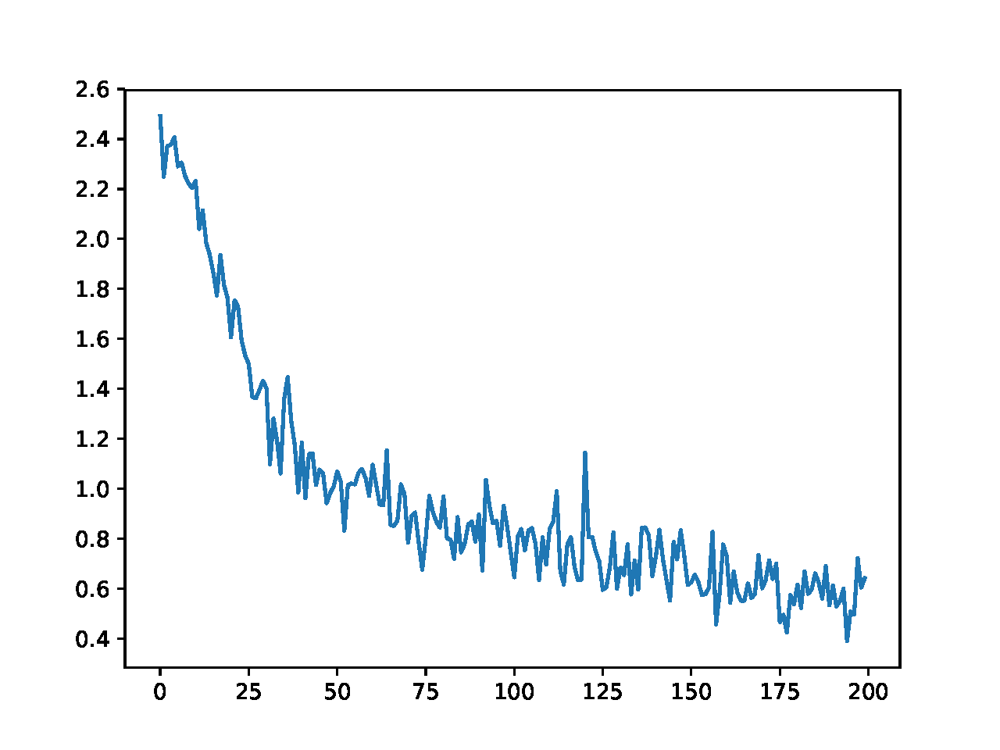
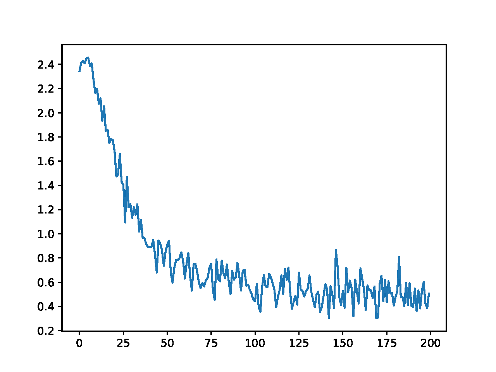
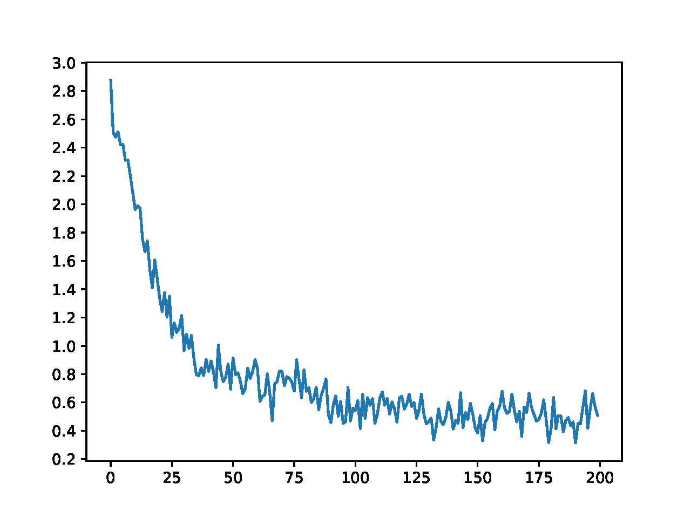
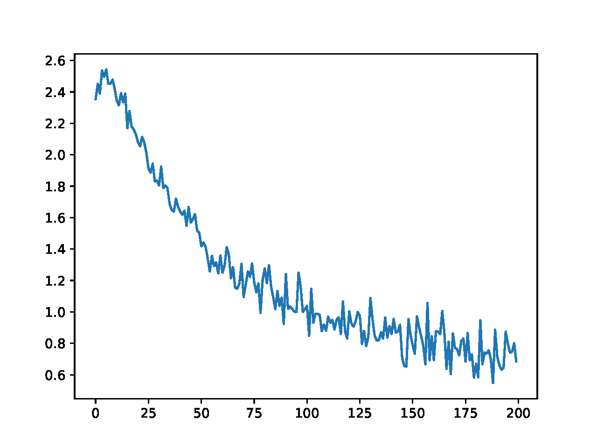
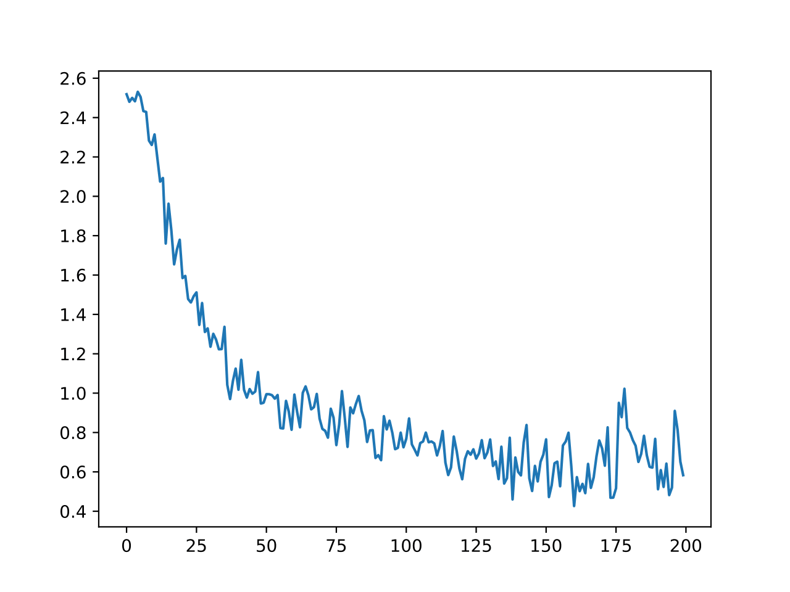
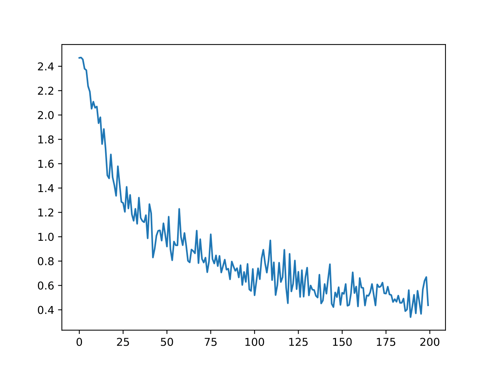

[markdown cheetsheet](https://guides.github.com/features/mastering-markdown/)  
# Part I  
## Q1 Network architecture  
* Describe the network architecture for the encoder:  
  * RNN used: gated recurrent unit (GRU)
  * Dimension of hidden state: `hidden_size`
  * Dimension of input embedding: `hidden_size`

* Describe the network architecture for the decoder model:  
  * RNN used: gated recurrent unit (GRU)
  * Dimension of hidden state: `hidden_size`
  * Dimension of input embedding: `hidden_size`
  * Non-linearity functions used: soft-max ` nn.LogSoftmax()`
  * Attention computation: 
    1. compute input embedding `embedded` and then use dropout to drop some elements of the embedding vector
    2. compute attention weight vector `attn_weights` based on input embedding and previous hidden state
    3. compute context vector `attn_applied` based on attention weight vector  `attn_weights` and all source hidden states `encoder_outputs`
    4. concatenate `embedded` with `attn_applied`, which is treated as the new input into the GRU

## Q2 Describe hyperparameters  
* n_iters:  determines the effort allocated for training a model. If n_iters is too small, the model might under-fit. Otherwise, it might over-fit.

* learning_rate: determines the sensitivity of weights w.r.t. its gradients. If learning_rate is too small, the model might not converge. Otherwise, the model might take more iterations to train.

## Q3 Select hyperparameters  
* Describe the experiments you ran to select those values, and explain your reasoning.  

  * n_iters

  | n_iters                   | 5000       | 10000      | 15000      | 20000      | 25000      |
  | ------------------------- | ---------- | ---------- | ---------- | ---------- | ---------- |
  | **Average edit distance** | **1.4063** | **1.2674** | **1.0926** | **1.1832** | **2.9958** |

  We can see that when `n_iters` is too small or too large, the model under-fits or over-fits.

  * learning_rate

  | learning_rate             | 0.001      | 0.005      | 0.01       | 0.05       | 0.1         |
  | ------------------------- | ---------- | ---------- | ---------- | ---------- | ----------- |
  | **Average edit distance** | **1.3705** | **0.7600** | **1.1832** | **2.9937** | **16.7221** |

  We can see that when `learning_rate` is small, the model converges slowly and under-fits. When `learning_rate` is too large, the model cannot converge well.

## Q4 and Q5 teacher forcing  

* Explain how training works if teacher_forcing is set to 0, and if teacher_forcing is set to 1  
  * When `teacher_forcing_ratio` is set to 0, `use_teacher_forcing` is always false, so the decoder will use the decoder's guess as the next inputs. 
  * When `teacher_forcing_ratio` is set to 1, `use_teacher_forcing` is always true, so the decoder will use the real target output as the next input.

* Investigate the impact of teacher forcing empirically. Report learning curves for 0.1, 0.5 and 0.9, and explain what you observe.
  * `teacher_forcing_ratio=0.1`

    

  * `teacher_forcing_ratio=0.5`

    

  * `teacher_forcing_ratio=0.9`

    

    We can see that as `teacher_forcing_ratio` increases, the loss decreases faster. In other words, using teacher forcing can make learning converge faster.

## Q6 attention model  
* why the attention model is useful to model transliteration  

  Attention model is useful because it can help the decoder to focus on related sub-strings. For example, 'beijing' and 'peking' share the substrings `e` and `ing`. The attention vector is supposed to focus on these two sub-strings.

## Q7 noattention.py  
* Without attention

  * learning curve

    

  * average edit distance at test time  = 1.4589

* With attention

  * learning curve

    

  * average edit distance at test time = 1.1832

## Q8 comparison  
* comparing the behavior of the sequence-to-sequence model with and without attention empirically, at training and test time  
  * From the results in Q7, we observe that during training, the seq2seq model with attention converges faster than the one without attention. 
  * During test time, the average edit distance of seq2seq model with attention  (1.1832) is smaller than the one without attention (1.4589).

# Part II  
## Q9 explain what you did  
* Define the problem that you are addressing:  
  We have attempted two improvements, but at this time, only one is working. I will expalin the working solution here and leave the other attempt to extra credit.  
  From the output of baseline implementation, we have observed alot of outputs that hase correct prediction at the begining but incorrect prediction towards the end.  
    This problem is expecially prominent for longer words.
* Explain why this problem matters  
  This problem would cause longer words to have higher editing distance. 

* Describe your proposed solution  
  We tried to use bidirectional variance of the vanila seq2seq model.
* Explain how your solution addresses the problem  
  bidirectional seq2seq model use two layers of encoder to represent the sequence. One layer going from begining to end of sequence as usual, the other going opposite direction. This approach would help the encoder to alleviate long distance problem.

## Q10

Design an experiment to test whether your solution successfully addresses the problem (e.g., compare the performance of your new model with the baseline system on the validation set, as well as the learning curves.). Present and discuss your results.  If the results are unexpected, explain what you think went wrong, and provide supporting analysis.  
We will use the learning curve and the resulting editing distance for comparison metrics. 
The following to graphs show the learning curve for baseline and the one for bidirectional.
The bidirectional model has smoother learning curve and has a slightly lower editing distance of 1.16 as opposed to 1.18 of the baseline.  
This result is not as good as we expected. I think the reason is that the input words are not long enough to take advantage of bidirectional model. For sentance the average length is longer than our input words and the maximum length would be alot longer. So, we did not get the expected improvement from bidirectional model.

* baseline:  
    
* bidirectional model:  
    

## Q11  
Provide the implementation so we can replicate your results. You can create additional files as needed as long as they are in the p3 directory. Instructions for running the code should be provided in the readme file. Note that it is your responsibility to test your code and make sure the instructions are accurate and self-contained.  If the code doesn't run, we will not attempt to debug it.  By default, we will evaluate by running the following command to train a transliteration model, and evaluate it on held out test data:  
For the bidirectional model, run the `transliterate_bi.py` with the same argument as the provided code.

# Part III  
## extra credit  
will be used to reward groups that experiment with ambitious ideas that require substantially more work and deeper understanding of the model (e.g., successfully using reinforcement learning or minimum risk training to incorporate edit distance during training would lead to extra-credit.):

We were originally working on a batched version of attention seq2seq model. But at this time we still have problem when calling `loss.backward(retain_graph=True)`. Our code is in `attentionRNN_driver.py` and `attentionRNN.py`. The second file contains the new model. We are trying to take advantage of the function `rnn.pack_padded_sequence` to process small batch of words of different length. A long with these packing process, we have also implemented the padding, sorting and masking tricks that was introduced in class. The goal of this implementation is to have a faster process time and a better generalization. The expectation of getting better generalization is due to the fact that the gradients is accumulated and applied in batchs, so the most recent sentence has less effect in the the back prop setp. In this batch process, we also adopted randomization of input batch and the concept of epochs. In stead of randomly drawing examples from the traning pool, we formulate the training pool into random batches. Each epoch would run the entire training pool one time. This could be the plateform for cross-validation which would eliminate the hyper-parameter tuning of number of training iteration.  
To test our batch processing model run the `attentionRNN_driver.py` with the same command line argument.

